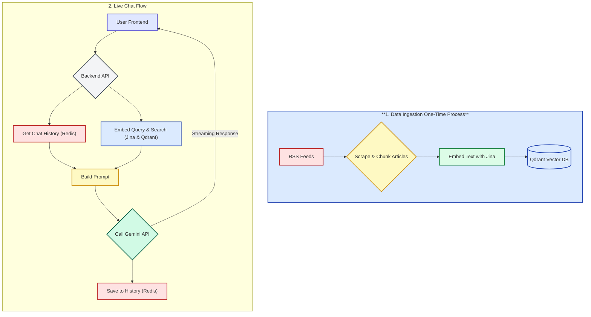

## RAG BASED AI CHAT BOT

Backend for a chatbot that ingests feeds, stores and manages data, and provides query responses powered by LLMs, with session management

## Overview

This project provides the backend for a **Retrieval-Augmented Generation (RAG) news application**.  
It is designed around two main processes:

### 1. Data Ingestion (One-Time / Periodic)
- Collects news articles from multiple **RSS feeds**.  
- Scrapes and cleans article HTML into plain text using **Cheerio**.  
- Splits long content into manageable text chunks.  
- Generates embeddings for each chunk via **Jina AI**.  
- Stores the embeddings and metadata in a **Qdrant vector database** for efficient similarity search.  

### 2. Live Chat & Query Handling (Real-Time)
- Exposes a **REST + WebSocket API** using **Express**.  
- `/chat` endpoint:  
  - Accepts user query + session ID.  
  - Embeds the query with **Jina**.  
  - Retrieves top-k passages from **Qdrant**.  
  - Fetches session history from **Redis**.  
  - Builds a contextual prompt (history + retrieved passages + query).  
  - Sends the prompt to the **Gemini API**.  
  - Returns or streams Gemini’s final answer to the client.  
  - Updates session history in **Redis**.  
- `/session` endpoint:  
  - Fetches chat history from Redis.  
  - Clears a session’s history on demand.  

With this architecture, the backend powers a **news assistant** that:  
- Grounds answers in real, up-to-date news content,  
- Maintains per-session conversational context, and  
- Serves responses efficiently with Redis caching and Qdrant vector search.


## ⚡ Tech Stack

1. **Node.js + Express.js** — Backend runtime and web framework for building REST APIs and WebSocket services.  
2. **Redis** — In-memory data store used for chat session history and fast lookups.  
3. **Qdrant** — Vector database for storing and retrieving news embeddings with similarity search.  
4. **Jina** — Embedding service to generate vector representations of news articles and queries.  
5. **Gemini** — Large Language Model (LLM) used to generate the final grounded answer based on retrieved passages.  


Other Libraries: {axios,cheerio,cors,dotenv,rss-parser,helmet,morgan,UUID}

---

## 📂 Folder Structure
```
Backend/
├── node_modules/ # Dependencies
├── src/
│ ├── controllers/ # Controller logic for routes
│ │ ├── chatControllers.js
│ │ └── sessionControllers.js
│ │
│ ├── routes/ # Express route definitions
│ │ ├── chat.js
│ │ └── session.js
│ │
│ ├── services/ # Core service modules
│ │ ├── embeddings.js # Jina embedding service wrapper
│ │ ├── gemini.js # Gemini API wrapper
│ │ ├── qdrant.js # Qdrant vector DB utilities
│ │ └── sessionStore.js # Redis session handling
│ │
│ └── tools/ # Scripts & entry points
│ ├── ingest-run.js # Script for RSS ingestion
│ └── server.js # Express server entry
│
├── .env # Environment variables
├── .env.example # Sample env config
├── .gitignore
├── package.json
├── package-lock.json

```
---
## 🏗️ Architecture



# ⚙️ Installation & How to Run

## Prerequisites
- Node.js 18+  
- npm or pnpm or yarn
- Git  
- (Optional) Docker & Docker Compose  

---

## 📥 Clone and Install 

- Clone the repo into your directory using git clone <repo_url>  
- Install all the dependencies required using `npm install` or `yarn install`  
- Create a `.env` file in the root folder (same level as `package.json`)  
  - Copy all variables from `.env.example`  
  - Fill in the values with your own credentials (Qdrant, Redis, Jina, Gemini, etc.)  

---

## 🐳 Optional (If you are using Docker)  

Run these commands to start Qdrant and Redis locally:  

- `docker run -d --name qdrant -p 6333:6333 qdrant/qdrant`  
- `docker run -d --name redis-local -p 6379:6379 redis:7`  

---

## 🚀 Run the Project  

- Run `node tools/ingest-run.js` (one time or periodically to ingest RSS feeds)  
- Run `node src/server.js` (**Hurray! Your Server is Live... 🎉**)  

**Note:** Make sure you are inside the **backend folder** while executing the commands.  


**Note** If you are not using docker make sure you have api URL for deployed qdrant and Redis and paste those values in .env 


## TTL Configuration

To configure TTL i have used clearSession which clears the data for a particular session if user is inactive for more than an hour.i have placed this clearSession inside the function storing the data in the cache so that the timer gets updated if user types any query.


